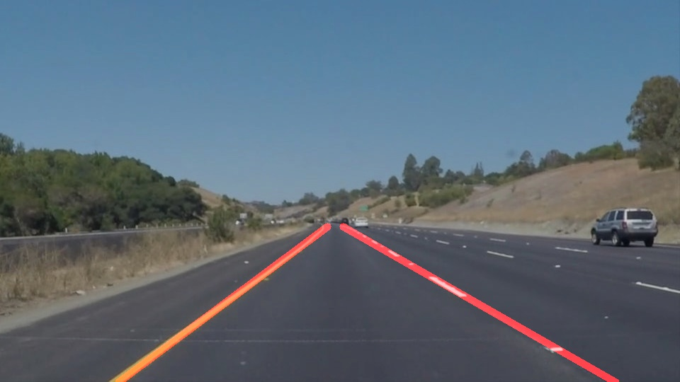

# **Finding Lane Lines on the Road** 
[](http://www.udacity.com/drive)
*Self Driving Car Nanodegree - Term 1 Project*

[//]: # (Image References)
[img_roi]: ./writeup_img/roi.jpg "Region of interest visualization"

Overview
---

The project aims in finding lanes on a video stream taken from a front-facing camera mounted on a car.
The project is developed using Python and OpenCV.
An example output is presented below:



Lane detection is performed via a software pipeline described below.

### 1. Pipeline description

#### Pipeline
My pipeline is represented by the function ```lane_extraction_pipeline()``` that takes in input an image and return the same image with the detected lane printed on it
The pipeline consists of 5 steps:

1. Grayscale conversion
2. Gaussian smoothing 
3. Canny edge detector
4. Region of interest extraction
5. Hough Transform

Firstly I focused in region of interest shape and coordinates. 
I finally decided for a trapezoidal shape represented in the following example image:

![alt text][img_roi]

#### Parameters tuning
In the whole pipeline there are 8 parameters to tune:

Algorithm | Parameter | 
------------ | ------------
Gaussian Smoothing | **kernel size** 
Canny Detector |  **low threshold**
Canny Detector |  **high threshold**
Hough Transform |  **rho** 
Hough Transform |  **theta** 
Hough Transform |  **intersection threshold**
Hough Transform |  **min line length**
Hough Transform  | **max line gap**

In order to tune them effectively I decided to create a tuning GUI contained into tuning_gui folder of this repository. The GUI is made using opencv visualization library.
The folder tuning_gui is composed by three files:

1. **cv_lib.py** containing the functions originally present in notebook provided
2. **cv_lane_detector.py** containing the wrapper function ```lane_extaction_pipeline``` previously defined
3. **tuning_gui.py** where there is the main GUI code. This scripts accepts two command line parameters
```
  -d, --dir                       Directory where to find test images
  -s, --step {0,1,2,3,4,5}        Step number whose output will be plotted in GUI. 0 for all pipeline
```

With the tuning GUI it is possible to visualize pipeline total result or the intermediate result of a single step via the corresponding parameter.

![alt text][img_tuning_gui_canny]![alt text][img_tuning_gui]

When the GUI is closed the program will print in the terminal the final value of the parameters used.

Final parameters used:

Algorithm | Parameter | Value
------------ | ------------ | -------------
Gaussian Smoothing  |  **kernel size** | 7
Canny Detector |  **low threshold** | 80
Canny Detector |  **high threshold** | 160
Hough Transform |  **rho** | 2
Hough Transform |  **theta** | 1 rad
Hough Transform |  **intersection threshold** | 15
Hough Transform |  **min line length** | 10
Hough Transform |  **max line gap** | 10

#### Single line extraction
In order to draw a single line on the left and right lanes, I modified the draw_lines() function by:

1. Grouping the lines by their slope and their position. 
Lines on left half of the image and with a slope < 0 are grouped for left side line.
Lines on right half of the image and with a slope > 0 are grouped for right side line.
2. Choosing the dominant line for each of the two groups.
Dominant line is defined as the line that passed through the average between all the points of a group and through the two bases of the trapezoid of the ROI. These two points are computed using line equation with computed slope and passing through average point with the two value of the ROI trapezoid bases


